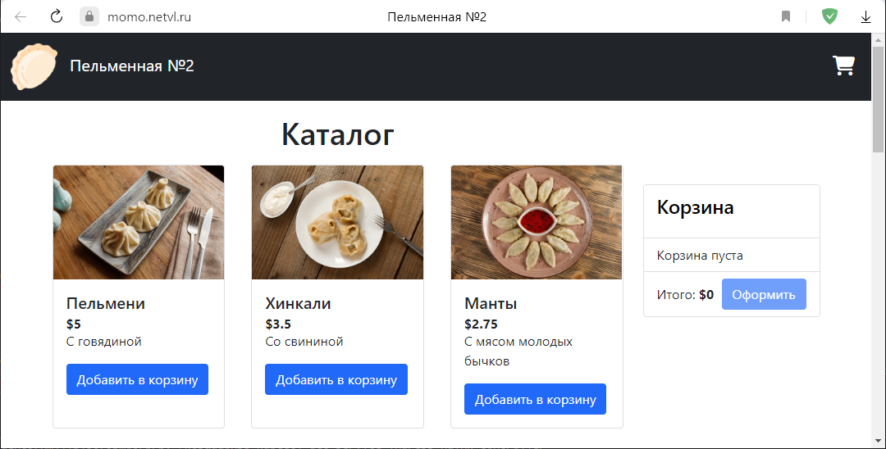
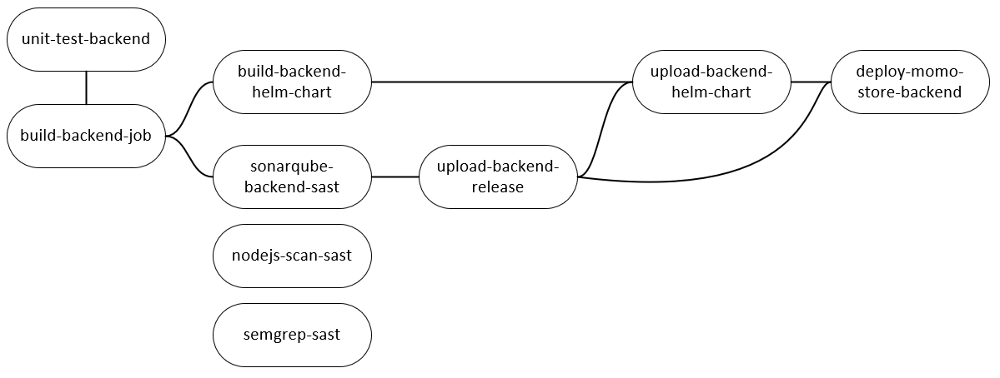
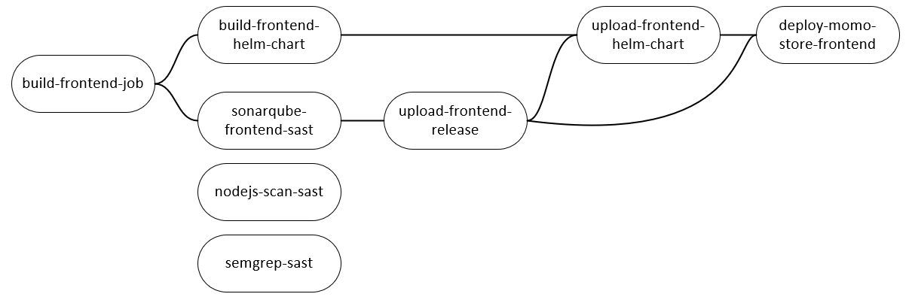
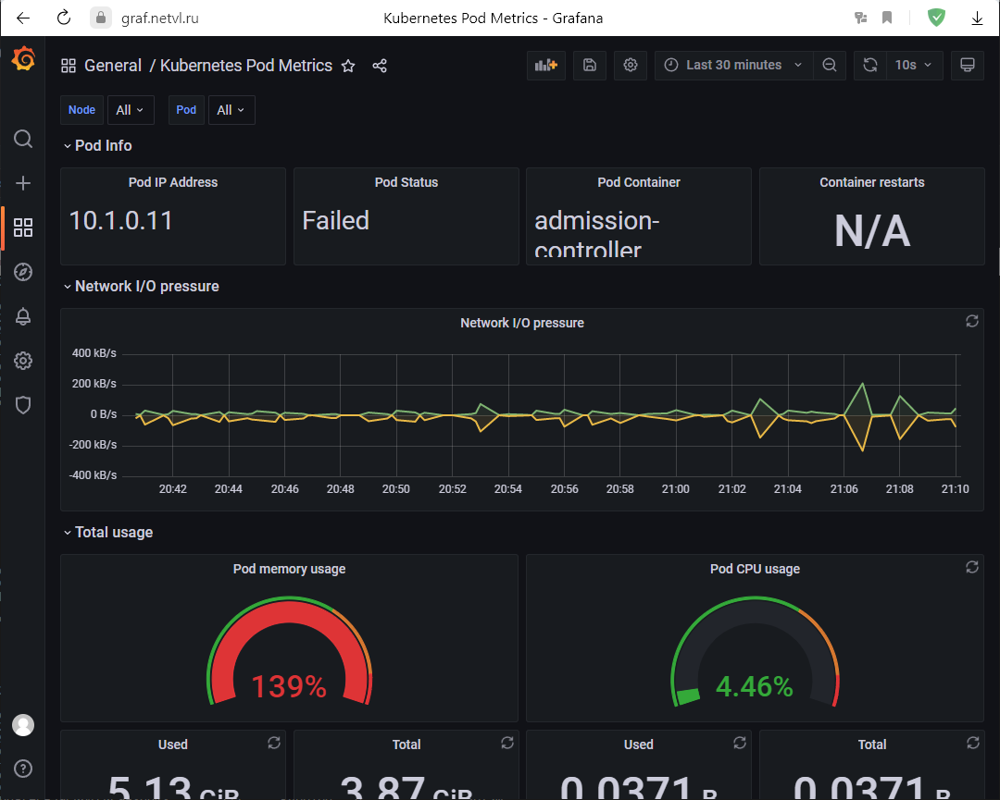
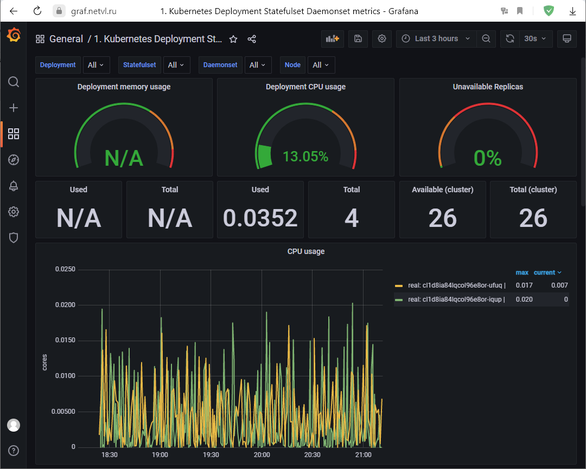

[TOC]

# Проект - Пельменная 2.0

|  |
| :--------------------------------: |
|  *Общий вид работающего проекта*   |


### Цель проекта

- Применить знания полученные в процессе обучения.
- Получить полностью рабочее приложение интернет магазина "Пельменная 2.0", развернутое в Яндекс облаке с использованием сервиса Yandex Managed Service for Kubernetes.


### Устройство репозитория

```
.
├── backend
├── backend-helm
├── frontend
├── frontend-helm
├── infrastructure
│  ├── k8s-addons
│  │  ├── k8saddons.sh
│  │  └── sa.yaml
│  └── terraform
│    ├── config.s3.tfbackend
│    ├── main.tf
│    ├── outputs.tf
│    ├── provider.tf
│    ├── variables.tf
│    └── versions.tf
├── README.md
└── readme-pics
```

**backend**: Исходный код приложения backend

**backend-helm**: Helm-чарты приложения backend

**frontend**: Исходный код приложения frontend

**frontend-helm**: Helm-чарты приложения frontend

**infrastructure**:

- **k8s-addons**:
  - **k8saddons.sh** - Скрипт для подготовки кластера k8s для деплоя пельменной
  - **sa.yaml** - Манифест Kubernetes для создания пользователя кластера k8s
- **terraform**:
  - **config.s3.tfbackend** - Конфигурация s3 бакета для хранения состояния terraform
  - **main.tf** - Конфигурация инфраструктуры
  - **outputs.tf** - Информация, которая будет выведена на экран после отработки terraform
  - **provider.tf** - Настройки провайдера Yandex
  - **variables.tf** - Переменные используемые в деплое инфраструктуры
  - **versions.tf **- Настройки провайдера

**README.md** - Файл с описанием проекта (этот файл) в формате Mark Down

**readme-pics** - Директория с изображениями использованными в README.md

## 1. Развертывание инфраструктуры

- Все манипуляции производятся в личном облаке Yandex Cloud

- В качестве инфраструктуры для деплоя "Пельменной" был выбран Yandex Managed Service for Kubernetes


### Подготовка

Перед разверткой инфраструктуры необходимо выполнить следующие подготовительные работы:

1. Создать Организацию
2. Создать Директорию
3. Создать S3 Бакет для хранения состояния terraform
4. Создать сервисный аккаунт с ролью editor на каталог
5. Создать статический ключ доступа для S3 Бакета, для сервисного аккаунта


### Создание кластера Managed Service for Kubernetes

Создание кластера Kubernetes состоит из двух пунктов:

Первый - Создание самого кластера

Второй - создание группы узлов (Ноды)

#### Описание создания кластера Managed Service for Kubernetes

- Для создания кластера используется Terraform.
- Разворачиваемая версия k8s - 1.23, так как в этой версии можно использовать docker в качестве container runtime
- Используется один публичный IP адрес для последующего доступа к кластеру по API (kubectl)

**Шаги развертки кластера:**

1. Создается сервисный аккаунт "myaccount"
2.  Назначаются роли на этот аккаунт:
   1. k8s.clusters.agent
   2. load-balancer.admin
   3. vpc.publicAdmin
   4. container-registry.images.puller
   5. viewer

3. Создаются ключ шифрования важной информации, такой как пароли, SSH-ключи
4. Создаются группы безопасности для взаимодействия компонентов кластера между собой и с внешним миром
5.  Создается vpc сеть "mynet"
6. Создается подсеть "mysubnet"
7. Создается кластер Managed Service for Kubernetes. При создании кластера происходят такие события:
   1. Назначается группа безопасности
   2. Назначается сервисный аккаунт для управления кластером
   3. Назначается сервисный аккаунт для управления нодами
   4. Указываются зависимости процедуры развертки кластера от других ресурсов

#### Описание создания группы узлов

- Создаются виртуальные машины с минимальным количеством ресурсов
- Количество нод - 2
- Используются прерываемые виртуальные машины

**Шаги развертки группы узлов:**

1. Разворачиваются прерываемые виртуальные машины
2. В качестве container runtime используется docker
3. Назначаются группы безопасности

#### Запуск выполнения кода terraform по развертке кластера Kubernetes

Для развертки кластера  необходимо перейти в директорию `infrastructure/k8s` и выполнить команду:

Инициализация terraform:

```bash
terraform init -var token=<IAM TOKEN для доступа к облаку> -backend-config="access_key=<Идентификатор ключа>" -backend-config="secret_key=<Секретный ключ>" -backend-config config.s3.tfbackend
```

Развертка кластера:

```bash
terraform apply -var token=<IAM TOKEN для доступа к облаку> -var cloud_id=<ID Облака> -var folder_id=<ID Каталога>
```

### Итог выполнения кода terraform по развертке кластера Kubernetes

- Если при развертке кластера k8s всё пройдет успешно, terraform отобразит ID созданного кластера, который понадобится в следующем шаге.
- После выполнения кода terraform получим рабочий и готовый к подключению по API кластер Managed Service for Kubernetes.


## 2. Подготовка кластера Kubernetes к деплою приложения пельменной

После развертки кластера Kubernetes необходимо провести ряд настроек в кластере для успешного деплоя пельменной:

1. Создать пользователя для работы с kubernetes
2. Создать статический файл конфигурации для kubectl
3. Установить Ingress-Nginx-Controler
4. Установить VPA для автоматического вертикального масштабирования

 Файлы, необходимые для действий по подготовке кластера находятся в директории `k8s-addons`.

Для успешного выполнения действий по подготовке кластера к деплою приложения понадобятся следующие вещи:

1. Виртуальная машина с установленным ПО:

   1. **yc** - Интерфейс командной строки для работы с Облаком Яндекса (Потребуется настройка для работы с облаком. [Инструкция](https://cloud.yandex.ru/docs/cli/quickstart))

   2. **kubectl** - инструмент командной строки для управления кластерами Kubernetes

   3. **jq** - Утилита для анализа и обработки JSON

2. Файлы из директории `k8s-addons` 

      1. **k8saddons.sh** - Скрипт подготавливающий кластер для деплоя приложения пельменной.
      2. **sa.yaml** - Манифест kubernetes описывающий создание пользователя

Выбор устройства, на котором предполагается выполнять действия по подготовке кластера к деплою приложения пельменной, ложится на инфраструктурного инженера и рамках данного проекта не рассматривается.

Это может быть как рабочий компьютер инженера так и VPS развёрнутый в облаке Яндекса.

### Действия по подготовке кластера

1. Перейти в директорию k8s-addons
2.  Выполнить скрипт k8saddons.sh, при этом будут созданы пользователь kubernetes, статический конфигурационный файл  и сертификат для подключения к кластеру.

**Содержимое скрипта k8saddons.sh:**

```bash
#!/bin/bash

CLUSTER_ID=<ID Кластера>
CLUSTER_NAME=<Имя кластера>
TEMP_KUBECFG=<Имя временного файла конфигурации k8s>
STAT_KUBECFG=<Имя файла статической конфигурации k8s>
yc managed-kubernetes cluster get-credentials $CLUSTER_ID --external --kubeconfig $TEMP_KUBECFG
yc managed-kubernetes cluster get --id $CLUSTER_ID --format json | jq -r .master.master_auth.cluster_ca_certificate | awk '{gsub(/\\n/,"\n")}1' > ca.pem
kubectl --kubeconfig=$TEMP_KUBECFG create -f sa.yaml
SA_TOKEN=$(kubectl --kubeconfig=$TEMP_KUBECFG -n kube-system get secret $(kubectl --kubeconfig=$TEMP_KUBECFG -n kube-system get secret | grep admin-user | awk '{print $1}') -o json | jq -r .data.token | base64 --d)
MASTER_ENDPOINT=$(yc managed-kubernetes cluster get --id $CLUSTER_ID --format json | jq -r .master.endpoints.external_v4_endpoint)
kubectl --kubeconfig=$TEMP_KUBECFG config set-cluster $CLUSTER_NAME --certificate-authority=ca.pem --server=$MASTER_ENDPOINT --kubeconfig=$STAT_KUBECFG
kubectl --kubeconfig=$TEMP_KUBECFG config set-credentials admin-user --token=$SA_TOKEN --kubeconfig=$STAT_KUBECFG
kubectl --kubeconfig=$TEMP_KUBECFG config set-context default --cluster=$CLUSTER_NAME --user=admin-user --kubeconfig=$STAT_KUBECFG
kubectl --kubeconfig=$TEMP_KUBECFG config use-context default --kubeconfig=$STAT_KUBECFG
cp -rf $STAT_KUBECFG ~/.kube/config
cp -rf ca.pem ~/.kube/ca.pem
helm repo add ingress-nginx https://kubernetes.github.io/ingress-nginx
helm repo update
helm install ingress-nginx ingress-nginx/ingress-nginx
helm repo add cowboysysop https://cowboysysop.github.io/charts/
helm repo update
helm install my-release cowboysysop/vertical-pod-autoscaler
```

**Детальное объяснение скрипта k8saddons.sh:**

Объявление переменных:

```bash
CLUSTER_ID=<ID Кластера>
CLUSTER_NAME=<Имя кластера>
TEMP_KUBECFG=<Имя временного файла конфигурации k8s>
STAT_KUBECFG=<Имя файла статической конфигурации k8s>
```

Генерация временного файла конфигурации k8s:

```bash
yc managed-kubernetes cluster get-credentials $CLUSTER_ID --external --kubeconfig $STAT_KUBECFG
```

Получение сертификата для авторизации в кластере k8s:

```bash
yc managed-kubernetes cluster get --id $CLUSTER_ID --format json | jq -r .master.master_auth.cluster_ca_certificate | awk '{gsub(/\\n/,"\n")}1' > ca.pem
```

Создание пользователя для управления кластером k8s:

```bash
kubectl --kubeconfig=$TEMP_KUBECFG create -f sa.yaml
```

Получение токена доступа для созданного пользователя:

```bash
SA_TOKEN=$(kubectl --kubeconfig=$TEMP_KUBECFG -n kube-system get secret $(kubectl --kubeconfig=$TEMP_KUBECFG -n kube-system get secret | grep admin-user | awk '{print $1}') -o json | jq -r .data.token | base64 --d)
```

Получение внешнего IP для подключения к кластеру k8s:

```bash
MASTER_ENDPOINT=$(yc managed-kubernetes cluster get --id $CLUSTER_ID --format json | jq -r .master.endpoints.external_v4_endpoint)
```

Создание статического конфигурационного файла для подключения к k8s:

```bash
kubectl --kubeconfig=$TEMP_KUBECFG config set-cluster $CLUSTER_NAME --certificate-authority=ca.pem --server=$MASTER_ENDPOINT --kubeconfig=$STAT_KUBECFG
kubectl --kubeconfig=$TEMP_KUBECFG config set-credentials admin-user --token=$SA_TOKEN --kubeconfig=$STAT_KUBECFG
kubectl --kubeconfig=$TEMP_KUBECFG config set-context default --cluster=$CLUSTER_NAME --user=admin-user --kubeconfig=$STAT_KUBECFG
kubectl --kubeconfig=$TEMP_KUBECFG config use-context default --kubeconfig=$STAT_KUBECFG
```

Копирование статического конфигурационного файла в директорию .kube:

| <span style="color:red">Внимание! Данный шаг приведет к замене файла config! Сделайте резервную копию своего конфигурационного файла.</span> |
| ------------------------------------------------------------ |

```bash
cp -rf $STAT_KUBECFG ~/.kube/config
```

Копирование сертификата, необходимого для подключения к кластеру k8s в директорию .kube:

| <span style="color:red">Внимание! Данный шаг приведет к замене файла сертификата! Сделайте резервную копию своего файла сертификата.</span> |
| ------------------------------------------------------------ |

```bash
cp -rf ca.pem ~/.kube/ca.pem
```

Установка Ingress NGINX Controler и Vertical Pod Autoscaler:

```bash
helm repo add ingress-nginx https://kubernetes.github.io/ingress-nginx
helm repo update
helm install ingress-nginx ingress-nginx/ingress-nginx
helm repo add cowboysysop https://cowboysysop.github.io/charts/
helm repo update
helm install my-release cowboysysop/vertical-pod-autoscaler
```


После установки ingress-nginx-Controller, необходимо получить публичный IP адрес Ingress контроллера и создать A запись в DNS.

```bash
$: ~/k8saddons$ kubectl get service ingress-nginx-controller
NAME                       TYPE           CLUSTER-IP     EXTERNAL-IP     PORT(S)                      AGE
ingress-nginx-controller   LoadBalancer   10.96.148.48   158.160.56.91   80:32180/TCP,443:32339/TCP   23m
```


### Итог выполнения задач по подготовке кластера к деплою пельменной

В итоге, после выполнения скрипта, получим пользователя и его конфиг для подключения к кластеру k8s. В кластере k8s будут созданы VPA для вертикального масштабирования ресурсов подов и Ingress-Nginx-Controler, который необходим для организации внешнего доступа к приложению и для обеспечения работы приложения по протоколу HTTP.

Так же, после работы скрипта, будут созданы два файла: **config** и **ca.pem**, содержимое данных файлов необходимо поместить в CI/CD переменные GitLab.

## 3. Развертывание приложения

- Для развертывания приложения используются CI/CD возможности GitLab
- Артефакты сборки версионируются и хранятся в GitLab Container Registry
- Helm-чарты публикуются и версионируются в Nexus

### Описание окружения проекта

#### Переменные

| Номер | Имя переменной         | Описание                                                     |
| ----- | ---------------------- | ------------------------------------------------------------ |
| 1     | BACKEND_KEY            | Название проекта Backend в SonarQube                         |
| 2     | BACKEND_LOGIN          | SonarQube Token для Backend                                  |
| 3     | DOCKERCONFIGJSON_BACK  | k8s Secret для работы с образами docker backend              |
| 4     | DOCKERCONFIGJSON_FRONT | k8s Secret для работы с образами docker frontend             |
| 5     | FRONTEND_KEY           | Название проекта Frontend в SonarQube                        |
| 6     | FRONTEND_LOGIN         | SonarQube Token для Frontend                                 |
| 7     | KUBECA                 | Сертификат, необходимый для подключения к кластеру k8s       |
| 8     | KUBECFG                | Статический конфигурационный файл для подключения к кластеру k8s |
| 9     | NAMESPACE              | Название Namespace для Helm чартов                           |
| 10    | NEXUS_REPO_PASS        | Пароль от Nexus репозитория                                  |
| 11    | NEXUS_REPO_URL         | URL Nexus репозитория для Helm чартов                        |
| 12    | NEXUS_REPO_USER        | Имя пользователя от Nexus репозитория                        |
| 13    | SONARQUBE_URL          | URL сервера SONARQUBE                                        |
| 14    | TLS_SECRET             | Секрет k8s с SSL сертификатом для работы пельменной по протоколу HTTPS |


#### CI/CD Пайплайны

В проекте присутствует один общий пайплайн в корне проекта и два downstreem-пайплайна в директориях frontend и backend, которые будут срабатывать только при изменениях в этих директориях.


### Сборка проекта

- Сборка приложения, его публикация в репозиторий Gitlab и деплой происходят автоматически.
- Сборка Helm чартов, их публикация в репозиторий Nexus и установка на кластер k8s происходят автоматический.

#### Сборка и публикация Backend

Сборка  и публикация backend состоит из следующих этапов:

1. **unit-test**

   На этом этапе проходят golang юнит тесты приложения backend.

2. **build**

   На этом этапе происходят сборка как самого приложения backend, так и Helm чартов.

3. **test**

   Здесь происходит тестирование приложения backend встроенными в GitLab тестами SAST и тестирование с использвоанием SonarQube.

4. **release**

   На этом этапе собранное приложение backend загружается в репозиторий GitLab, а собранные Helm чарты в репозиторий Nexus.

5. **deploy**

   На этом этапе происходит деплой приложения backend в кластер Kubernetes.


|                                  |
| :----------------------------------------------------------: |
| *Схема зависимостей этапов сборки и публикации backend приложения пельменной* |


#### Сборка Frontend

#### Сборка и публикация Frontend

Сборка  и публикация frontend состоит из следующих этапов:

1. **build**

   На этом этапе происходят сборка как самого приложения frontend, так и Helm чартов.

2. **test**

   Здесь происходит тестирование приложения frontend встроенными в GitLab тестами SAST и тестирование с использвоанием SonarQube.

3. **release**

   На этом этапе собранное приложение frontend загружается в репозиторий GitLab, а собранные Helm чарты в репозиторий Nexus.

4. **deploy**

   На этом этапе происходит деплой приложения frontend в кластер Kubernetes.


|                                 |
| :----------------------------------------------------------: |
| *Схема зависимостей этапов сборки и публикации frontend приложения пельменной* |


### Итог сборки и публикации приложения пельменной

Итогом сборки и публикации пельменной является полностью рабочее приложение запущенное в кластере Kubernetes, доступное для подключения по протоколу HTTPS

URL пельменной:

[https://momo.netvl.ru](https://momo.netvl.ru)

|  |
| :--------------------------------: |
|  *Скриншот работающей пельменной*  |


## Мониторинг

Для отслеживания состояния кластера Kubernetes и работающих в нём подов, настроены Prometheus и Grafana.

- Grafana доступна по ссылке: [https://graf.netvl.ru](https://graf.netvl.ru)

- Логин и пароль будут переданы в комментарии к MR

- Созданы два дашборда с основными метриками:

  1. Kubernetes Pod Metrics

  2. Kubernetes Deployment Statefulset Daemonset metrics


|  |
| :---------------------------------------: |
|    *Kubernetes Pod Metrics Dashboard*     |


|              |
| :---------------------------------------------------: |
| *Kubernetes Deployment Statefulset Daemonset metrics* |


# Итог проекта

- Приложение Пельменной развернуто и работает в Яндекс облаке с использованием сервиса Yandex Managed Service for Kubernetes.
- Инфраструктура разворачивается соглсно IaC (Terraform)
- Деплой проекта происходит используя Gitlab CI
- Приложение доступно по защищенному протоколу HTTPS: [https://momo.netvl.ru](https://momo.netvl.ru)
- Для мониторинга приложения используются Prometheus и Grafana
- Grafana доступна по защищенному протоколу HTTPS: [https://graf.netvl.ru](https://graf.netvl.ru)
- В репозитории находится файла README.md (*Этот файл*)


### Выполненные пункты из чеклиста для проверки (по моему мению)

| Выполнено (Да/Нет)      | Пункты чеклиста                                              |
| ----------------------- | ------------------------------------------------------------ |
| Да                      | Код хранится в GitLab с использованием любого git-flow       |
| Да                      | В проекте присутствует `.gitlab-ci.yml`, в котором описаны шаги сборки |
| Да                      | Артефакты сборки (бинарные файлы, docker-образы или др.) публикуются в систему хранения (Nexus или аналоги) |
| Да                      | Артефакты сборки версионируются                              |
| Да                      | Написаны Dockerfile'ы для сборки Docker-образов бэкенда и фронтенда |
| Да                      | В GitLab CI описан шаг сборки и публикации артефактов        |
| Да                      | В GitLab CI описан шаг тестирования                          |
| Да                      | В GitLab CI описан шаг деплоя                                |
| Да                      | Развёрнут Kubernetes-кластер в облаке                        |
| Да                      | Kubernetes-кластер описан в виде кода, и код хранится в репозитории GitLab |
| **Нет**                 | Конфигурация всех необходимых ресурсов описана согласно IaC  |
| Да                      | Состояние Terraform'а хранится в S3                          |
| **Нет**                 | Картинки, которые использует сайт, или другие небинарные файлы, необходимые для работы, хранятся в S3 |
| Да                      | Секреты не хранятся в открытом виде                          |
| Да                      | Написаны Kubernetes-манифесты для публикации приложения      |
| Да                      | Написан Helm-чарт для публикации приложения                  |
| Да                      | Helm-чарты публикуются и версионируются в Nexus              |
| **Да/Нет - Мониторинг** | Приложение подключено к системам логирования и мониторинга   |
| **Да/Нет - Мониторинг** | Есть дашборд, в котором можно посмотреть логи и состояние приложения |
